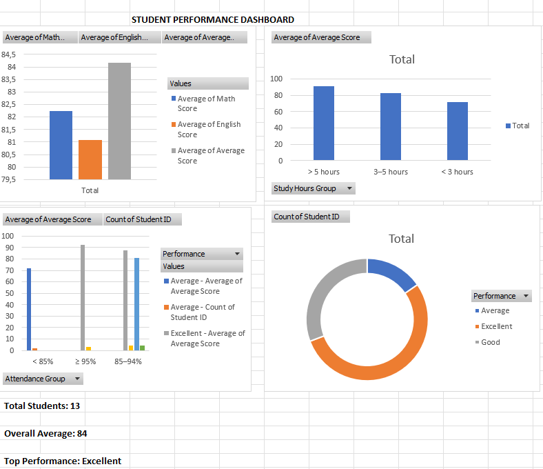

# Student Performance Analysis

## Overview

This project analyzes a synthetic student performance dataset using Microsoft Excel.

The analysis focuses on the relationship between study hours, attendance, and academic performance.

## Objectives

- Analyze average scores by subject
- Compare academic performance by gender
- Analyze study hours and average scores
- Analyze attendance and academic performance
- Identify student performance distribution
- Create an interactive-style Excel dashboard

## Tools

- Microsoft Excel
- PivotTable
- PivotChart
- Data Cleaning
- Data Analysis
- Data Visualization

## Dataset

The dataset contains synthetic student data including:

- Student ID
- Gender
- Study Hours per Week
- Attendance
- Math Score
- English Score
- Science Score

The dataset is synthetic and does not contain real student personal information.

## Data Cleaning

The dataset was cleaned by:

- Standardizing inconsistent gender formatting
- Handling missing values
- Identifying and correcting invalid score values
- Converting numeric fields into the correct data type

## Analysis

The project includes analysis of:

1. Average score by subject
2. Average score by gender
3. Average score by study hours
4. Attendance and performance
5. Performance distribution

## Key Insights

- Students with higher attendance tended to have higher average scores in this dataset.
- Students in the highest study-hour group showed higher average scores in this dataset.
- The distribution of students across performance categories was analyzed using PivotTables.

## Dashboard

## Disclaimer

This project uses a synthetic dataset created for educational and portfolio purposes.
